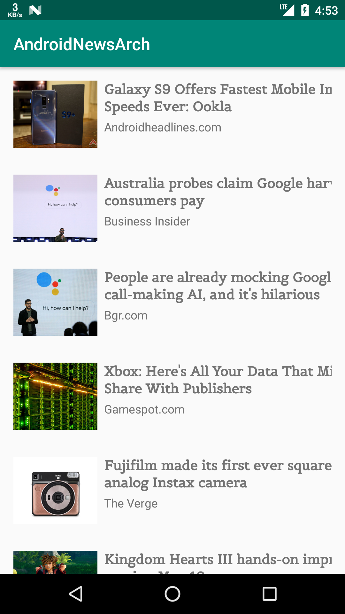

# Sample MVVM News Application

Sample app ini dibuat untuk riset mengenai architecture MVVM dan LiveData, dengan tujuan memahami konsep MVVM
dan bagaimana penggunaan LiveData untuk menyimpan state data sehingga data masih ada ketika device di rotate,
selain itu pada project ini juga telah menerapkan Dagger 2 untuk Dependency Injection dengan penambahan support untuk android.

# Technology Stack

- Kotlin
- RxJava
- Retrofit
- Dagger2
- LiveData

# Todo
- [ ] create fragment for detail news
- [ ] implement navigation component
- [ ] implement room for save data locally
- [ ] favorite feature

## Reference
- https://github.com/antonicg/cryptodata
- News API from https://newsapi.org/
- ADB
